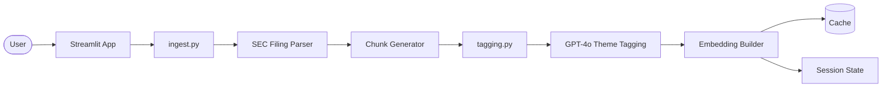
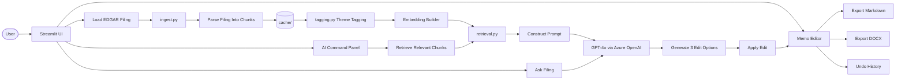

# 10-K Pair-Writer

A Streamlit app for drafting investment reports against SEC 10-K filings, with GPT-4o as a writing partner. Every model-inserted claim is grounded in a citation back to the filing.

## Setup

1. Create a virtual environment and install dependencies:

```bash
python3.11 -m venv venv
source venv/bin/activate
pip install -r requirements.txt
```

2. Copy `.env.example` to `.env` and add your OpenAI API key:

```bash
cp .env.example .env
# edit .env and set OPENAI_API_KEY
```

3. Run the app:

```bash
streamlit run app.py
```

## How to use

1. Paste an EDGAR 10-K filing URL into the top input. Use the "Filing Index" page URL or the direct HTML document URL.
   - Find filings at: https://www.sec.gov/cgi-bin/browse-edgar?action=getcompany
   - Example URL format: `https://www.sec.gov/Archives/edgar/data/320193/000032019324000123/aapl-20240928.htm`

2. Wait for ingest + theme tagging (~30-60s for first load, instant on subsequent loads thanks to caching).

3. Start drafting your report in the middle pane. Type rough thoughts, or use the right-side command bar to ask GPT-4o for help.

4. To target a specific paragraph, click "Select" next to it before typing your instruction. Otherwise the instruction applies to the whole report.

5. The model returns 3 options. Pick one to apply, or click "Try 3 more" to regenerate.

6. Citations appear as `[1A·¶3]` pills. Click to scroll the filing pane to the source.

7. Export the report via the Markdown or DOCX buttons in the header.

## Features

### AI-Assisted Investment Report Writing
- GPT-4o-powered writing partner for SEC filing analysis
- Generate 3 distinct edit options for every instruction
- Targeted paragraph editing or whole-report expansion
- Inline manual editing with undo support
- Structured edit operations (`replace`, `insert_after`, `delete`)

### Filing-Aware Retrieval (RAG)
- Embedding-based semantic retrieval over 10-K filings
- Theme-aware filtering and retrieval
- Retrieval grounding for every AI-generated edit
- Citation-aware generation pipeline

### SEC Filing Intelligence
- Automatic EDGAR ingestion and parsing
- Item-aware chunking (`1A`, `7`, `7A`, `8`, etc.)
- Theme tagging across filing sections
- Table + paragraph extraction support

### Research & Analysis
- Ask questions directly against the filing
- Conversational research workflow
- Source retrieval inspection
- Citation-linked evidence tracing

### Editing Workflow
- Multi-option proposal generation
- Regenerate divergent alternatives
- Stable paragraph-ID document model
- Full report history + revert system
- Manual and AI-assisted editing hybrid workflow

### Export & Persistence
- Markdown export
- DOCX export
- Cached filing ingestion + embeddings
- Session-persistent editing state

---

## Project Structure

```text
10-k-pair-writer/
├── README.md
├── requirements.txt
├── .env.example
├── app.py                          # Streamlit application entrypoint
├── ssl_patch.py                    # SSL compatibility patch
│
├── ingest.py                       # SEC EDGAR ingestion + parsing
├── tagging.py                      # Filing theme tagging via GPT-4o
├── retrieval.py                    # Embedding generation + semantic retrieval
├── edits.py                        # Report editing engine + proposal application
├── prompts.py                      # System prompts + generation templates
├── export.py                       # Markdown + DOCX export utilities
│
├── cache/                          # Cached parsed filings
│   ├── *.json
│   └── *.pkl
│
├── docs/
│   ├── ARCHITECTURE.md
│   ├── RETRIEVAL.md
│   └── PROMPTS.md
│
└── assets/
    └── screenshots/
```

---

# System Design

## High-Level Architecture

```text
┌─────────────────────────────────────────────────────────────────────┐
│                         STREAMLIT FRONTEND                         │
│                                                                     │
│  app.py                                                             │
│                                                                     │
│  ┌────────────────────┐      ┌──────────────────────────────────┐   │
│  │ LEFT PANE          │      │ RIGHT PANE                      │   │
│  │ Report Editor        │      │ AI Command Console              │   │
│  │                    │      │                                  │   │
│  │ • Paragraphs       │      │ • Generate 3 Options             │   │
│  │ • Inline Editing   │      │ • Ask Filing                     │   │
│  │ • History          │      │ • Retrieved Sources              │   │
│  │ • Undo/Revert      │      │ • Conversation                   │   │
│  └─────────┬──────────┘      └──────────────┬───────────────────┘   │
│            │                                 │                       │
│            └──────────────┬──────────────────┘                       │
│                           │                                          │
│                    Streamlit Session State                           │
└───────────────────────────┼──────────────────────────────────────────┘
                            │
                            ▼
┌─────────────────────────────────────────────────────────────────────┐
│                        APPLICATION LAYER                            │
├─────────────────────────────────────────────────────────────────────┤
│                                                                     │
│  ingest.py                                                          │
│  • EDGAR HTML fetch                                                 │
│  • Filing parsing                                                   │
│  • Semantic chunking                                                │
│                                                                     │
│  tagging.py                                                         │
│  • GPT-4o theme tagging                                             │
│  • Filing-wide taxonomy extraction                                  │
│                                                                     │
│  retrieval.py                                                       │
│  • Embedding generation                                             │
│  • Semantic retrieval                                               │
│  • Theme filtering                                                  │
│                                                                     │
│  edits.py                                                           │
│  • Report document model                                              │
│  • Edit proposal generation                                         │
│  • JSON parsing                                                     │
│  • Edit application engine                                          │
│                                                                     │
│  export.py                                                          │
│  • Markdown export                                                  │
│  • DOCX export                                                      │
│                                                                     │
└───────────────────────────┼──────────────────────────────────────────┘
                            │
                            ▼
┌─────────────────────────────────────────────────────────────────────┐
│                          AI / MODEL LAYER                           │
├─────────────────────────────────────────────────────────────────────┤
│                                                                     │
│                      Azure OpenAI APIs                              │
│                                                                     │
│  • GPT-4o chat completions                                          │
│  • Embedding generation                                             │
│  • Theme tagging                                                    │
│  • Memo editing                                                     │
│  • Filing Q&A                                                       │
│                                                                     │
└───────────────────────────┼──────────────────────────────────────────┘
                            │
                            ▼
┌─────────────────────────────────────────────────────────────────────┐
│                             DATA LAYER                              │
├─────────────────────────────────────────────────────────────────────┤
│                                                                     │
│  Filing Object                                                      │
│  • company_name                                                     │
│  • chunks[]                                                         │
│  • items_present[]                                                  │
│                                                                     │
│  Chunk Object                                                       │
│  • chunk_id                                                         │
│  • text                                                             │
│  • themes[]                                                         │
│  • embedding                                                        │
│                                                                     │
│  Memo Object                                                        │
│  • paragraphs[]                                                     │
│  • edit history                                                     │
│                                                                     │
└─────────────────────────────────────────────────────────────────────┘
```

---

# Request Flow

## Filing Ingestion Pipeline



---

## AI Editing Pipeline



## Filing Q&A Pipeline


---

# Core Design Concepts

## Retrieval-Augmented Generation (RAG)

The application uses a retrieval-first architecture:

```text
User Query
    ↓
Embedding Search
    ↓
Relevant Filing Chunks
    ↓
LLM Prompt Context
    ↓
Grounded AI Output
```

This ensures:
- Reduced hallucination risk
- Filing-grounded edits
- Citation-backed outputs
- Higher factual reliability

---

## Structured Edit Proposal System

Instead of raw text generation, the model returns structured edit proposals:

```json
{
  "op": "replace",
  "anchor": "m3",
  "variation_axis": "stance",
  "options": [
    {
      "label": "Bullish",
      "new_text": "...",
      "rationale": "..."
    }
  ]
}
```

Benefits:
- Deterministic edit application
- Multi-option comparison
- Safer report editing
- Better undo/revert support

---

## Paragraph-Based Report Model

The report is represented as stable paragraph objects:

```text
Report
 ├── m1
 ├── m2
 ├── m3
 └── m4
```

Advantages:
- Fine-grained editing
- Stable references
- Scoped generation
- Better edit tracking
- Easier diffing + history management

## Visuals


## Demo
[streamlit-app-2026-05-21-20-13-35.webm](https://github.com/user-attachments/assets/961b03ad-14a0-48bc-840d-ef9019c78bee)

## Pitch Deck
[10-K-Pair-Writer.pptx](https://github.com/user-attachments/files/28126403/10-K-Pair-Writer.pptx)


